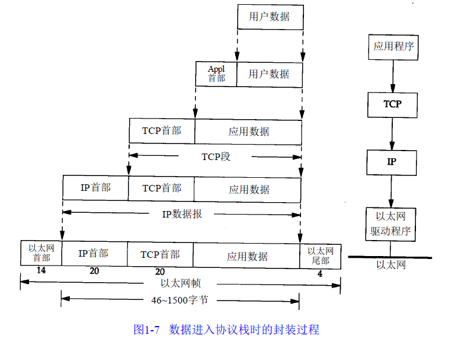
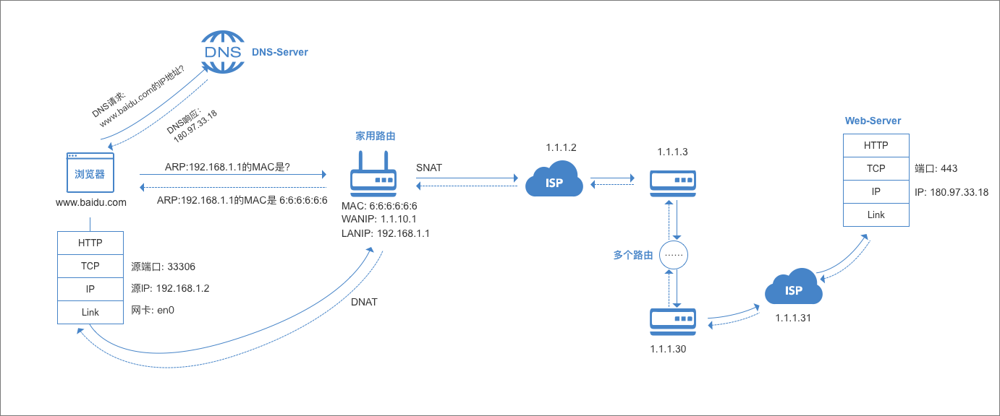
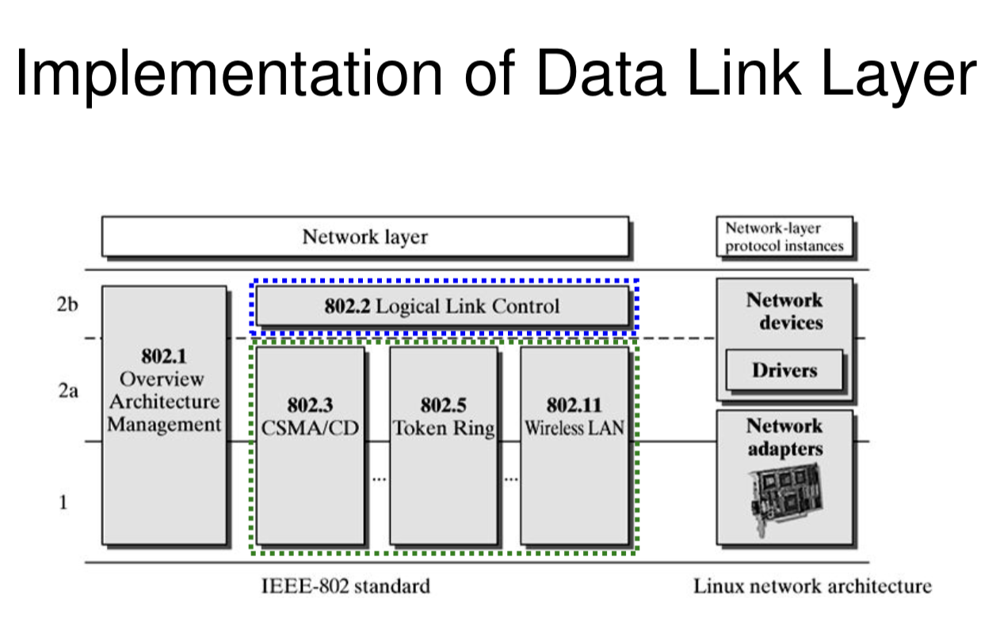

#  netstack
用golang 实现tcp/ip协议

src_code 是用来学习的源码

# TCPIP 和开放系统互连（OSI）模型

本节先简单介绍互联网的发展史，然后讲解 TCPIP 和开放系统互连（OSI）模型，最后会介绍一下用户态协议栈的整体框架。

## 计算机互联网发展史
最开始的时候计算机是单独运算的，一般有一个大型主机放在那里，然后可以多个终端连接一个主机进行操作。那时候美国国防部认为，如果仅有一个集中的军事指挥中心，万一这个中心被原苏联摧毁，全国的军事指挥将处于瘫痪状态，其后果将不堪设想，因此有必要设计这样一个分散的指挥系统，它由一个个分散的指挥点组成，当部分指挥点被摧毁后其它点仍能正常工作，而这些分散的点又能通过某种形式的通讯网取得联系，这个研究项目就是著名的 ARPANET（阿帕网），也就是互联网的前身。在 1969 年，ARPANET 真正把计算机第一次互联，使用 BBN 公司开发的接口消息处理器（IMP）建立节点。当时的详细节点信息如下：

``` markdown
节点1：UCLA(8月30日，9月2日接入)
功能：网络测量中心
主机、操作系统：SDS SIGMA 7

节点2：斯坦福研究院(SRI)(10月1日)
功能：网络信息中心(NIC)
主机、操作系统：SDS940
Doug Engelbart有关Augmentation of Human Intellect的计划

节点3：加州大学圣巴巴拉分校(UCSB)(11月1日)
功能：Culler-Fried交互式数学
主机、操作系统：IBM 360/75

节点4：Utah大学(12月)
功能：图形处理
主机、操作系统：DEC PDP-10
由Steve Crocker编写第一份RFC文件Host Software(1969年4月7日)。
REC 4：Network Timetable
UCLA的Charley Kline试图登录到SRI上，发出了第一个数据包，
他的第一次尝试在键入LOGIN的G的时候引起了系统的崩溃。(1969年10月20日或29日，需查实)
```

可以看出，当时硬件和系统都不是统一的，当然通信的接口也是不统一的，他们需要 IMP 连接和处理才能彼此通信。

> ARPANET 的特点

- 可以共享硬件、软件和数据库资源。
- 利用分散控制结构。
- 应用分组交换技术（包交换技术）。
- 运用高功能的通信处理机。
- 采用分层的网络协议。

ARPANET 早期使用一种网络控制协议（Network Control Protocol，NCP）来达到主机与主机之间的通信，但是它无法和个别的计算机网络做交流，因为设备之间没有一个标准协议。1972 年，ARPANET 项目组的核心成员 Vinton Cerf 和 Bob Kahn 开始合作开展所谓的网络互联相互（Interneting Project）。他们希望连接不同的网络，使得一个网络上的主机能够与另一个主机网络上进行通信，需要克服的问题很多：不同的分组大小、不同的接口类型、不同的传输速率、以及不同的可靠性要求。Cerf 和 Kahn 提出利用被称为网关的一种设备作为中间的硬件，进行一个网络到另一个网络的数据传输。

之后 Cerf 和 Kahn 在 1974 年发表了里程碑式的文章 Protocol for Packet Network Interconnection，描述了实现端到端数据投递的协议，这是一个新版的 NCP，叫传输控制协议（TCP）。这篇文章包括了封装、数据报、网关的功能等概念，其中主要思想是把纠错功能从 IMP 移到了主机。同时该协议（TCP）被应用到 ARPANET 网络，但是此时依然没有形成一个网络标准，各种协议并存包括 NCP，TCP 等协议。

在 1977 年后，TCP 被拆分成两个网络协议：传输控制协议（TCP）和因特网协议（IP），IP 处理数据包的路由选择，TCP 负责高层次的功能，如分段、重组、检错。这个新的联合体就是人们熟知的 TCP/IP。

1980 年发表 UDP 协议。

1981 年 UNIX 系统集成了 TCP/IP 协议栈，包含网络软件的流行操作系统对网络的普及起了很大的作用。

1983 年原先的交流协议 NCP 被禁用，TCP/IP 协议变成了 ARPANET 的正式协议，同时 ARPANET 分裂成两个网络：军用网（MILNET）和非军用的 ARPANET。之后，NCP 成为历史，TCP/IP 开始成为通用协议。

1984 年 ISO 发布了开放式系统互联模型（OSI）。

再之后，互联网极速发展，更多的主干网被搭建，更多的主机连接进来，直至组成了世界互联的巨大网络。

## OSI 模型和 TCPIP 模型

> OSI 模型

|层级|level|
|:------:|:------------:|
| 应用层 | Application  |
| 表示层 | Presentation |
| 会话层 | Session      |
| 传输层 | Transport    |
| 网络层 | Network      |
| 链路层 | Link         |
| 物理层 | Physical     |

> TCPIP 模型

|层级|level|
|:------:|:------------:|
| 应用层 | Application|
| 传输层 | Transport|
| 网络层 | Network|
| 链路层 | Link|

虽然现实中实现的协议栈都是 TCP/IP 模型，但是我们也需要了解 OSI 模型，它很有参考意义，我们平常交流讲到网络分层的时候都是用 OSI 模型来讲的，所以开发者一般实现的时候是 TCPIP 模型，但和别人讨论的时候是 OSI 模型。比如我们一般讲的二层网络，三层网络指的是 OSI 模型的链路层和网络层。下面介绍 TCP/IP 模型各层功能。

## TCPIP 各个层的主要功能
### 链路层
链路层也是将数据包发送到另一台主机，但是这两台主机一定是同个局域网的（不考虑广域网二层打通的情况），链路层负责将网络层交下来的 IP 数据报组装成帧，在两个相邻节点间的链路上传送帧。链路层的通信就像在一栋小楼里面互相讲话一下，小明想与小红讲话，只要在楼里喊一下，“小红你在吗？”，小红听到了就会回复说，“小明，我在啊”。小明在喊小红的时候，在这栋楼里的其他人也听得到，这种行为叫广播。链路层网络不适合大型网络，因为一旦主机多了，广播会比较占用资源，就像楼里大家都在喊别人一下，听起来会很乱。

## 网络层
网络层负责将数据报从一台主机发送到一台目标主机上（注意：这两个主机可以不相邻），并给每个主机分配一个地址。最著名的就是 IP 协议了，每个主机都至少有一个 IP 地址，根据路由策略将收到数据报发往下一个主机，这个过程就叫路由转发，它是实现国际网的基础。对于网络层的通信，小明和小红就不是在一栋楼里了，他们可能隔了一个省，此时小明再怎么喊，小红也听不到，怎么办？那就寄信封吧，把信写好，交给邮差，邮差根据地址送给下一个驿站，驿站再根据地址送给下一站，知道送到小红那，这个过程就很像路由，根据目的地址选择下一跳地址。有时候小明有太多话想跟小红讲，导致一封信已经装不下了，那么就会用几张信封来装信件，这个过程就像分片，因上层数据包太大，将数据包切割。当然逆向过程就叫重组。

### 传输层
**传输层最主要的目的就是给两个应用程序传输数据，注意是两个程序，不是两个主机。***主要的协议有 tcp 和 udp，tcp 为应用提供了虚拟连接的服务，也提供了数据的可靠性。udp 提供的是无连接服务，也不提供可靠服务，仅仅实现让两个程序之间交换数据。

### 应用层
应用层是利用传输层的接口来实现用户自定义的网络应用，例如 HTTP 应用，SMTP（邮件传输）应用等。正因为应用层各色各样的应用，才让网络传输有了意义。比如微信，QQ，淘宝网等，这些我们常见的应用都离不开网络的传输。

### 为何要分层
分层当然是有原因的，主要的目的是为了灵活性和方便实现。分层可以允许供应商进行独立开发，各层通过一个接口在相邻层通信。每层只要专注自己的事情，而不是关心其他层，这样方便软件或者硬件的实现，定义好每个层之间的接口，更改一层的内部实现，不会影响其他层，这样更灵活。比如，TCP 协议就不管下一层是 ipv4 还是 ipv6，它们都实现了网络层的接口，能寻址发送和接收数据包。

这种思想到处可见，我们要解决一个复杂的问题时，一般都是拆分层小问题，然后分别解决小问题，分层也是一样，它的本质就是为了分离关注点而让问题简单化或者更高效。


## 封装与解封装
各个层需要加上自己的控制信息，就会为每层定义自己的控制信息，不同的协议层对数据包有不同的称谓，在传输层叫做段（segment），在网络层叫做数据报（datagram），链路层叫做帧（frame），物理层层叫比特，数据封装成帧后发到传输介质上，到达目的主机后每层协议再剥掉相应的首部，最后将应用层数据交给应用程序处理。

每层发送数据时加上自己的控制信息叫封装。


收到数据包剥掉相应的首部叫解封装，解封装的时候会得到上层的协议，去除本层首部信息后，将会把数据包分发给上层协议。


## 你是如何冲浪的呢

一般情况家里的上网流程如下，但不是一定是这样，请读者注意！

首先你得购买互联网服务提供商（ISP，如：中国电信）提供的账号密码；
- 启动家用路由器，假设路由器内网地址为 192.168.1.1，接着配置账号密码，通过拨号和 ISP 建立连接，ISP 会返回一个公网 IP 地址，假如 IP 为 1.1.10.1；
- 然后再把电脑插到家用路由器的网口上，那么电脑就获取到了内网 IP 地址，假如为 192.168.1.2，这时候家用路由器就是电脑的默认网关，和家用路由器的相连的网卡假设为 en0；
- 当在浏览器访问 https://www.baidu.com 时，浏览器会发起 DNS 请求得到对应的 IP，假如为 180.97.33.18，DNS 请求的详细过程我们暂时忽略；
- 拿到 IP 后，浏览器会使用 tcp 连接系统调用和远端主机建立连接，系统调用会进入内核；
- 内核先通过路由最长匹配查询目标 IP 下一跳地址，也就是邻居地址，比如目的 180.97.33.18 会匹配下一跳地址 192.168.1.1;
- 内核接着查询 ARP 表，得知下一跳地址的网卡和物理 MAC 地址，如果没有查询到，则会发送广播 ARP 请求，得到 MAC 地址；
- 到目前为止发送 tcp 报文所需的信息都有了，目标 IP 和目标 MAC 地址，此时系统会给 tcp 的连接分配一个源端口，假如为 33306；
- 之后完成 tcp 三次握手，将 HTTP 请求报文封装在 tcp 数据段中发送给网卡 en0；
- 家用路由器接收到电脑的数据报，经过源地址转换（SNAT），将数据报文发送给 ISP；
- ISP 通过路由表选择发送给下一个路由，经过多个路由转发最终达到百度的服务主机；
- 百度服务器得到电脑发送的报文，返回 HTTP 响应，按原路返回给家用路由器；
- 家用路由器接收到 HTTP 响应报文后，经过目标地址转换（DNAT），将数据发送给电脑；
- 电脑上的浏览器接收到 HTTP 响应，渲染页面，呈现出网页；

## 协议栈整体框架
本课程参考netstack，基于 linux 的 tap 网卡，来实现一个用户态的 tcp/ip 协议栈。

协议栈的整体架构如下：
|协议|网络层级|
|:--:|:------:|
|        tcp/udp       | transport|
|    arp/ipv4/ipv6     | network|
|         vnic         | nic_manager|
|         tap          | link|

- 链路层我们用 tap 网卡实现，它是 linux 下的一种虚拟网卡，能提供链路层的功能，发送和接收以太网帧。
- 协议栈还实现了对虚拟网卡的一定管理，就像 linux 对物理网卡的管理一样。
- 网络层实现了 arp、ipv4 和 ipv6 协议，arp 协议虽然被划分在网络层，但是链路层的工作离不开它，所以第二章讲链路层通信的时候会介绍。ipv4 协议中的 icmp 和 ipv6 中的邻居协议也实现了，后面会讲解 ipv4 和 icmp 协议。
- 传输层会实现了 tcp 和 udp，在讲传输层之前会先介绍端口的概念。传输层中的 tcp 实现应该是整个协议栈中最复杂的，会按功能拆分来讲解。

值得注意的是这里说的协议栈是主机上的协议栈，不是交换机，也不是路由器的协议栈。

整体来说，实现一个协议栈并没有想象中的那么复杂，如果排除了 tcp 的各种机制实现，那么协议栈其实很简单，就是封装与解封装的过程，所以协议栈的代码有很大部分也是各层对数据包的封装与解封装。tcp 的实现会根据每个特性来拆分讲解和实现，以便更容易理解和实现。

# 链路层
## 链路层的介绍和基本实现
本节主要介绍链路层的基本实现，主要讲以太网网卡、虚拟网卡和 arp 协议。

### 链路层的目的
数据链路层属于计算机网络的底层，使用的信道主要有点对点信道和广播信道两种类型。 在 TCP/IP 协议族中，数据链路层主要有以下几个目的：

1. 接收和发送链路层数据，提供 io 的能力。
2. 为 IP 模块发送和接收数据
3. 为 ARP 模块发送 ARP 请求和接收 ARP 应答
4. 为 RARP 模块发送 RARP 请求和接收 RARP 应答

**TCP/IP 支持多种不同的链路层协议，这取决于网络所使用的硬件。**
数据链路层的协议数据单元——`帧`：将 IP 层（网络层）的数据报添加首部和尾部封装成帧。 
数据链路层协议有许多种，都会解决三个基本问题，封装成帧，透明传输，差错检测。

### 以太网介绍
我们这章讲的是链路层，为何要讲以太网，那是因为以太网实在应用太广了，以至于我们在现实生活中看到的链路层协议的数据封装都是以太网协议封装的，所以要实现链路层数据的处理，我们必须要了解以太网。

以太网（Ethernet）是一种计算机局域网技术。IEEE 组织的 IEEE 802.3 标准制定了以太网的技术标准，它规定了包括物理层的连线、电子信号和介质访问层协议的内容。以太网是目前应用最普遍的局域网技术，取代了其他局域网标准如令牌环、FDDI 和 ARCNET。以太网协议，是当今现有局域网采用的最通用的通信协议标准，故可认为以太网就是局域网。

### 链路层的寻址
通信当然得知道发送者的地址和接受者的地址，这是最基础的。以太网规定，所有连入网络的设备，都必须具有“网卡”接口。然后**数据包是从一块网卡，传输到另一块网卡的**。网卡的地址，就是数据包的发送地址和接收地址，叫做 MAC 地址，也叫物理地址，这是最底层的地址。每块网卡出厂的时候，都有一个全世界独一无二的 MAC 地址，长度是 48 个二进制位，通常用 12 个十六进制数表示。有了这个地址，我们可以定位网卡和数据包的路径了。

### MTU（最大传输单元）
**MTU 表示在链路层最大的传输单元，也就是链路层一帧数据的数据内容最大长度，单位为字节**，MTU 是协议栈实现一个很重要的参数，请大家务必理解该参数。一般网卡默认 MTU 是 1500，当你往网卡写入的内容超过 1518bytes，就会报错，后面我们可以写代码试试。


上面的图片是 linux 上链路层的实现，链路层的实现可以分为三层，真实的以太网卡，网卡驱动，网卡逻辑抽象。

真实的网卡我们不关心，因为那是硬件工程，我们只需要知道，它能接收和发送网络数据给网卡驱动就好了。网卡驱动我们也不关心，一般驱动都是网卡生产商就写好了，我们只需知道，它能接收协议栈的数据发送给网卡，接收网卡的数据发送给协议栈。网卡逻辑抽象表示，这个是我们关心的，我需要对真实的网卡进行抽象，

在系统中表示，也需要对抽象的网卡进行管理。

> 注意：后面系统中网卡的逻辑抽象我们都描述为网卡。

比如在 linux 上，当你敲下 ifconfig 命令，会输出类似如下内容：

``` bash
eth0      Link encap:Ethernet  HWaddr 00:16:3e:08:a1:7a
          inet addr:172.18.153.158  Bcast:172.18.159.255  Mask:255.255.240.0
          UP BROADCAST RUNNING MULTICAST  MTU:1500  Metric:1
          RX packets:285941546 errors:0 dropped:0 overruns:0 frame:0
          TX packets:281609568 errors:0 dropped:0 overruns:0 carrier:0
          collisions:0 txqueuelen:1000
          RX bytes:142994767953 (142.9 GB)  TX bytes:44791940275 (44.7 GB)

lo        Link encap:Local Loopback
          inet addr:127.0.0.1  Mask:255.0.0.0
          UP LOOPBACK RUNNING  MTU:65536  Metric:1
          RX packets:363350690 errors:0 dropped:0 overruns:0 frame:0
          TX packets:363350690 errors:0 dropped:0 overruns:0 carrier:0
          collisions:0 txqueuelen:1
          RX bytes:28099158493 (28.0 GB)  TX bytes:28099158493 (28.0 GB)
```

示例里显示了两个网卡，一个 eth0 以太网网卡，一个 lo 本地回环网卡。还可以看到两个网卡的信息，当我们要表示一个网卡的时候，需要具备几个属性：

1. 网卡的名字、类型和 MAC 地址
- eth0 Link encap:Ethernet HWaddr 00:16:3e:08:a1:7a
    - eth0是网卡名，方便表示一个网卡，网卡名在同个系统里不能重复
    - Link encap:Ethernet 表示该网卡类型为以太网网卡。
    - HWaddr 00:16:3e:08:a1:7a 表示 MAC 地址 00:16:3e:08:a1:7a，是链路层寻址的地址。
2. 网卡的 IP 地址及掩码
- inet addr:172.18.153.158 Bcast:172.18.159.255 Mask:255.255.240.0
  - inet addr:172.18.153.158 表示该网卡的 ipv4 地址是 172.18.153.158。
  - Bcast:172.18.159.255 表示该网卡 ip 层的广播地址。
  - 255.255.240.0 该网卡的子网掩码。
3. 网卡的状态和 MTU
- UP BROADCAST RUNNING MULTICAST MTU:1500 Metric:1
    - UP BROADCAST RUNNING MULTICAST都是表示网卡的状态
      - UP（代表网卡开启状态） 
      - BROADCAST (支持广播) 
      - RUNNING（代表网卡的网线被接上）
      - MULTICAST（支持组播）。
    - MTU:1500 最大传输单元为 1500 字节。
    - Metric:1 接口度量值为 1，接口度量值表示在这个路径上发送一个分组的成本。

### linux的虚拟网卡介绍
实现协议栈，我们需要一个网卡，因为这样我们才能接收和发送网络数据，但是一般情况下，我们电脑的操作系统已经帮我们管理好网卡了，我们想实现自由的控制网卡是不太方便的，还好 linux 系统还有另一个功能-虚拟网卡，它是操作系统虚拟出来的一个网卡，我们协议栈的实现都是基于虚拟网卡，用虚拟网卡的好处是：

对于用户来说虚拟网卡和真实网卡几乎没有差别，而且我们控制或更改虚拟网卡大部分情况下不会影响到真实的网卡，也就不会影响到用户的网络。
虚拟网卡的数据可以直接从用户态直接读取和写入，这样我们就可以直接在用户态编写协议栈。
Linux 中虚拟网络设备
TUN/TAP 设备、VETH 设备、Bridge 设备、Bond 设备、VLAN 设备、MACVTAP 设备，下面我们只讲 tun/tap 设备，其他虚拟设备感兴趣的同学可以去网上自行搜索。

TAP/TUN 设备是一种让用户态和内核之间进行数据交换的虚拟设备，TAP 工作在二层，TUN 工作在三层，TAP/TUN 网卡的两头分别是内核网络协议栈和用户层,其作用是将协议栈中的部分数据包转发给用户空间的应用程序，给用户空间的程序一个处理数据包的机会。

当我们想在 linux 中创建一个 TAP 设备时，其实很容易，像普通文件一样打开字符设备 /dev/net/tun 可以得到一个文件描述符，接着用系统调用 ioctl 将文件描述符和 kernel 的 tap 驱动绑定在一起，那么之后对该文件描述符的读写就是对虚拟网卡 TAP 的读写。详细的实现可以看 (tuntap)[https://www.kernel.org/doc/Documentation/networking/tuntap.txt] 所以最终我们实现的协议栈和 TAP 虚拟网卡的关系，如下图：

 `userland netstack` <- `tap` <- kernel`

### tap网卡实验
在 linux 中创建虚拟网卡，我们可以用 linux 自带的 ip 命令来实现，关于 ip 命令的更多用法请看 man ip。

创建 tap 网卡

#### 创建一个tap模式的虚拟网卡tap0

``` bash

sudo ip tuntap add mode tap tap0
```

#### 开启该网卡

``` bash

sudo ip link set tap0 up
```

#### 设置该网卡的ip及掩码

``` bash

sudo ip addr add 192.168.1.1/24 dev tap0
```

我们创建一个为名 tap0，ip 及掩码为 192.168.1.1/24 的虚拟网卡，执行 ifconfig 看看，会看到一个 tap0 的网卡：

``` bash
tap0      Link encap:Ethernet  HWaddr 22:e2:f2:93:ff:bf
          inet addr:192.168.1.1  Bcast:0.0.0.0  Mask:255.255.255.0
          UP BROADCAST MULTICAST  MTU:1500  Metric:1
          RX packets:0 errors:0 dropped:0 overruns:0 frame:0
          TX packets:0 errors:0 dropped:0 overruns:0 carrier:0
          collisions:0 txqueuelen:1000
          RX bytes:0 (0.0 B)  TX bytes:0 (0.0 B)
 
```

         

删除网卡可以使用如下命令：

#### 删除虚拟网卡

``` bash

sudo ip tuntap del mode tap tap0
```

看起来和真实的网卡没有任何区别，接下来我们自己用 golang 来实现创建网卡。

golang 创建 tuntap 网卡的库实现，在 netstack/tcpip/link/tuntap 目录下可以查看源文件 tuntap.go 的代码：

``` go
// +build linux

package tuntap

import (
    "errors"
    "fmt"
    "os/exec"
    "syscall"
    "unsafe"
)

const (
    TUN = 1
    TAP = 2
)

var (
    ErrDeviceMode = errors.New("unsupport device mode")
)

type rawSockaddr struct {
    Family uint16
    Data   [14]byte
}

// 虚拟网卡设置的配置
type Config struct {
    Name string // 网卡名
    Mode int    // 网卡模式，TUN or TAP
}

// NewNetDev根据配置返回虚拟网卡的文件描述符
func NewNetDev(c *Config) (fd int, err error) {
    switch c.Mode {
    case TUN:
        fd, err = newTun(c.Name)
    case TAP:
        fd, err = newTAP(c.Name)
    default:
        err = ErrDeviceMode
        return
    }
    if err != nil {
        return
    }
    return
}

// SetLinkUp 让系统启动该网卡
func SetLinkUp(name string) (err error) {
    // ip link set <device-name> up
    out, cmdErr := exec.Command("ip", "link", "set", name, "up").CombinedOutput()
    if cmdErr != nil {
        err = fmt.Errorf("%v:%v", cmdErr, string(out))
        return
    }
    return
}

// SetRoute 通过ip命令添加路由
func SetRoute(name, cidr string) (err error) {
    // ip route add 192.168.1.0/24 dev tap0
    out, cmdErr := exec.Command("ip", "route", "add", cidr, "dev", name).CombinedOutput()
    if cmdErr != nil {
        err = fmt.Errorf("%v:%v", cmdErr, string(out))
        return
    }
    return
}

// AddIP 通过ip命令添加IP地址
func AddIP(name, ip string) (err error) {
    // ip addr add 192.168.1.1 dev tap0
    out, cmdErr := exec.Command("ip", "addr", "add", ip, "dev", name).CombinedOutput()
    if cmdErr != nil {
        err = fmt.Errorf("%v:%v", cmdErr, string(out))
        return
    }
    return
}

func GetHardwareAddr(name string) (string, error) {
    fd, err := syscall.Socket(syscall.AF_UNIX, syscall.SOCK_DGRAM, 0)
    if err != nil {
        return "", err
    }

    defer syscall.Close(fd)

    var ifreq struct {
        name [16]byte
        addr rawSockaddr
        _    [8]byte
    }

    copy(ifreq.name[:], name)
    _, _, errno := syscall.Syscall(syscall.SYS_IOCTL, uintptr(fd), syscall.SIOCGIFHWADDR, uintptr(unsafe.Pointer(&ifreq)))
    if errno != 0 {
        return "", errno
    }

    mac := ifreq.addr.Data[:6]
    return string(mac[:]), nil
}

// newTun新建一个tun模式的虚拟网卡，然后返回该网卡的文件描述符
// IFF_NO_PI表示不需要包信息
func newTun(name string) (int, error) {
    return open(name, syscall.IFF_TUN|syscall.IFF_NO_PI)
}

// newTAP新建一个tap模式的虚拟网卡，然后返回该网卡的文件描述符
func newTAP(name string) (int, error) {
    return open(name, syscall.IFF_TAP|syscall.IFF_NO_PI)
}

// 先打开一个字符串设备，通过系统调用将虚拟网卡和字符串设备fd绑定在一起
func open(name string, flags uint16) (int, error) {
    // 打开tuntap的字符设备，得到字符设备的文件描述符
    fd, err := syscall.Open("/dev/net/tun", syscall.O_RDWR, 0)
    if err != nil {
        return -1, err
    }

    var ifr struct {
        name  [16]byte
        flags uint16
        _     [22]byte
    }

    copy(ifr.name[:], name)
    ifr.flags = flags
    // 通过ioctl系统调用，将fd和虚拟网卡驱动绑定在一起
    _, _, errno := syscall.Syscall(syscall.SYS_IOCTL, uintptr(fd), syscall.TUNSETIFF, uintptr(unsafe.Pointer(&ifr)))
    if errno != 0 {
        syscall.Close(fd)
        return -1, errno
    }
    return fd, nil
}
```

根据这个库，我们写一个从网卡读取数据的程序，并打印读取到的字节数。新建文件 tcpip/lab/link/tap1/main.go，输入如下代码：

``` go
package main

import (
    "log"
    "tcpip/netstack/tcpip/link/rawfile"
    "tcpip/netstack/tcpip/link/tuntap"
)

func main() {
    tapName := "tap0"
    c := &tuntap.Config{tapName, tuntap.TAP}
    fd, err := tuntap.NewNetDev(c)
    if err != nil {
        panic(err)
    }

    // 启动tap网卡
    _ = tuntap.SetLinkUp(tapName)
    // 添加ip地址
    _ = tuntap.AddIP(tapName, "192.168.1.1/24")

    buf := make([]byte, 1<<16)
    for {
        rn, err := rawfile.BlockingRead(fd, buf)
        if err != nil {
            log.Println(err)
            continue
        }
        log.Printf("read %d bytes", rn)
    }
}
```


copy
然后进入目录 tcpip/lab/link/tap1 编译代码。

``` bash

cd ~/tcpip/lab/link/tap1/
go build
```

会生成一个叫 tap1 的可执行文件，我们执行它

``` bash

sudo ./tap1
```

稍等一会再打开另一个终端，利用 tcpdump 抓取经过 tap0 网卡的数据，如果执行 tap1，立马就抓包，可能会抓到一些 ipv6 的组播包，我们这里先忽略。

``` bash

sudo tcpdump -i tap0 -n
```

再打开另一个终端，我们试 ping 一下 192.168.1.1

``` bash

ping 192.168.1.1
```


但是 tcpdump 抓取数据的终端和我们自己写的打印网卡数据的终端中没有任何 icmp 数据，这是为何？这是因为当给一个网卡添加 ip 地址的时候，系统会将相应的路由添加到“本地路由表”，正因为这样，即使看起来 192.168.1.1 是 tap0 网卡的地址，但实际上我们 ping 的数据并没有走到 tap0 网卡，而是在 lo 网卡上，我们可以试试在终端抓去 lo 网卡数据

``` bash

sudo tcpdump src 192.168.1.1 -i lo -n
```

再 ping 一下 192.168.1.1 ，查看 tcpdump 的输出：

``` bash
listening on lo, link-type EN10MB (Ethernet), capture size 262144 bytes
22:40:18.028585 IP 192.168.1.1 > 192.168.1.1: ICMP echo request, id 29728, seq 1, length 64
22:40:18.028599 IP 192.168.1.1 > 192.168.1.1: ICMP echo reply, id 29728, seq 1, length 64
22:40:19.029912 IP 192.168.1.1 > 192.168.1.1: ICMP echo request, id 29728, seq 2, length 64
22:40:19.029925 IP 192.168.1.1 > 192.168.1.1: ICMP echo reply, id 29728, seq 2, length 64
```

查看本地路由的信息，通过 ip route show table local 命令。

``` bash
broadcast 10.211.55.0 dev enp0s5  proto kernel  scope link  src 10.211.55.14
broadcast 10.211.55.0 dev enp0s6  proto kernel  scope link  src 10.211.55.16
local 10.211.55.14 dev enp0s5  proto kernel  scope host  src 10.211.55.14
local 10.211.55.16 dev enp0s6  proto kernel  scope host  src 10.211.55.16
broadcast 10.211.55.255 dev enp0s5  proto kernel  scope link  src 10.211.55.14
broadcast 10.211.55.255 dev enp0s6  proto kernel  scope link  src 10.211.55.16
broadcast 127.0.0.0 dev lo  proto kernel  scope link  src 127.0.0.1
local 127.0.0.0/8 dev lo  proto kernel  scope host  src 127.0.0.1
local 127.0.0.1 dev lo  proto kernel  scope host  src 127.0.0.1
broadcast 127.255.255.255 dev lo  proto kernel  scope link  src 127.0.0.1
broadcast 192.168.1.0 dev tap0  proto kernel  scope link  src 192.168.1.1
local 192.168.1.1 dev tap0  proto kernel  scope host  src 192.168.1.1
broadcast 192.168.1.255 dev tap0  proto kernel  scope link  src 192.168.1.1

```

可以看到倒数第二行，表示了 192.168.1.1 这个地址，在 local 路由表里。同时路由表也显示，只有 192.168.1.1 这个地址在路由表里，该网段的其他地址不在本地路由，那么应该会进入 tap0 网卡，比如我们试试 192.168.1.2 这个地址，ping 一下

``` bash

PING 192.168.1.2 (192.168.1.2) 56(84) bytes of data.
From 192.168.1.1 icmp_seq=1 Destination Host Unreachable
From 192.168.1.1 icmp_seq=2 Destination Host Unreachable
```

然后 tcpdump 在 tap0 网卡上的输出

``` bash

listening on tap0, link-type EN10MB (Ethernet), capture size 262144 bytes
22:55:58.322022 ARP, Request who-has 192.168.1.2 tell 192.168.1.1, length 28
22:55:59.320824 ARP, Request who-has 192.168.1.2 tell 192.168.1.1, length 28
```

说明 tap0 网卡收到了 arp 请求，至于我们使用 ping 之后为何接收到的是 arp 请求报文而不是 icmp 报文，这是因为系统不知道 192.168.1.2 的 MAC 地址，后面会详细说明。

在上面的程序中，我们也可以看到上面的程序有打印：

``` bash
2018/11/11 23:54:10 read 42 bytes
2018/11/11 23:54:11 read 42 bytes
2018/11/11 23:54:12 read 42 bytes
2018/11/11 23:54:13 read 42 bytes

```

其实在链路层通信，是可以不需要 ip 地址的，我们可以手动配置路由，将数据导入虚拟网卡，现在更改我们的程序，代码存放在 tcpip/lab/link/tap2/main.go：

``` go
package main

import (
    "log"
    "tcpip/netstack/tcpip/link/rawfile"
    "tcpip/netstack/tcpip/link/tuntap"
)

func main() {
    tapName := "tap0"
    c := &tuntap.Config{tapName, tuntap.TAP}
    fd, err := tuntap.NewNetDev(c)
    if err != nil {
        panic(err)
    }

    // 启动tap网卡
    _ = tuntap.SetLinkUp(tapName)
    // 设置路由
    _ = tuntap.SetRoute(tapName, "192.168.1.0/24")

    buf := make([]byte, 1<<16)
    for {
        rn, err := rawfile.BlockingRead(fd, buf)
        if err != nil {
            log.Println(err)
            continue
        }
        log.Printf("read %d bytes", rn)
    }
}
```


进入目录 tcpip/lab/link/tap2，然后编译代码。

``` bash
cd ~/tcpip/lab/link/tap2

go build
```

会生成一个叫tap2的可执行文件，我们执行它

``` bash

sudo ./tap2
```

稍等一会再打开另一个终端，利用 tcpdump 抓取经过 tap0 网卡的数据。

``` bash

sudo tcpdump -i tap0 -n
```

再打开另一个终端，我们试 ping 一下 192.168.1.1

``` bash

ping 192.168.1.1
```

查看程序 tap2 的输出：

``` bash
2019/04/10 11:12:57 read 42 bytes
2019/04/10 11:12:58 read 42 bytes
2019/04/10 11:12:59 read 42 bytes
2019/04/10 11:13:16 read 42 bytes
2019/04/10 11:13:17 read 42 bytes
2019/04/10 11:13:18 read 42 bytes

```

这时候你 ping 192.168.1.0/24 网段的任何一个地址都是进入 tap0 网卡，这样我们就可以实验和处理 tap0 网上上的数据了。目前我们只看到了网卡有读取到数据，而且抓包显示我们现在接收到的数据都是 arp 请求，后面会实现对 arp 报文的处理，接下来我们开始处理网卡的数据并封装链路层，实现网卡的 io。

### 链路层数据帧
数据在链路层传输都是一帧一帧传输的，就像发送邮件一样，将信放入信封中，接着把信封邮寄出去，这样可以把一段信息和另一段信息区分开来，下面先介绍数据帧格式。


- 目的 MAC 地址：目的设备的 MAC 物理地址。
- 源 MAC 地址：发送设备的 MAC 物理地址。
- 类型：表示后面所跟数据包的协议类型，例如 Type 为 0x8000 时为 IPv4 协议包，Type 为 0x8060 时，后面为 ARP 协议包。
- 数据：表示该帧的数据内容，长度为 46 ～ 1500 字节，包含网络层、传输层和应用层的数据。

既然前面我们已经知道了链路层数据帧格式，也知道了链路层协议头的详细信息，那么现在就根据这些信息来处理以太网数据。我们把处理头部数据的代码都放在 header 包中

``` go
package header

import (
    "encoding/binary"

    "tcpip/netstack/tcpip"
)

// 以太网帧头部信息的偏移量
const (
    dstMAC  = 0
    srcMAC  = 6
    ethType = 12
)

// EthernetFields表示链路层以太网帧的头部
type EthernetFields struct {
    // 源地址
    SrcAddr tcpip.LinkAddress

    // 目的地址
    DstAddr tcpip.LinkAddress

    // 协议类型
    Type tcpip.NetworkProtocolNumber
}

// Ethernet以太网数据包的封装
type Ethernet []byte

const (
    // EthernetMinimumSize以太网帧最小的长度
    EthernetMinimumSize = 14

    // EthernetAddressSize以太网地址的长度
    EthernetAddressSize = 6
)

// SourceAddress从帧头部中得到源地址
func (b Ethernet) SourceAddress() tcpip.LinkAddress {
    return tcpip.LinkAddress(b[srcMAC:][:EthernetAddressSize])
}

// DestinationAddress从帧头部中得到目的地址
func (b Ethernet) DestinationAddress() tcpip.LinkAddress {
    return tcpip.LinkAddress(b[dstMAC:][:EthernetAddressSize])
}

// Type从帧头部中得到协议类型
func (b Ethernet) Type() tcpip.NetworkProtocolNumber {
    return tcpip.NetworkProtocolNumber(binary.BigEndian.Uint16(b[ethType:]))
}

// Encode根据传入的帧头部信息编码成Ethernet二进制形式，注意Ethernet应先分配好内存
func (b Ethernet) Encode(e *EthernetFields) {
    binary.BigEndian.PutUint16(b[ethType:], uint16(e.Type))
    copy(b[srcMAC:][:EthernetAddressSize], e.SrcAddr)
    copy(b[dstMAC:][:EthernetAddressSize], e.DstAddr)
}
```

### 网卡IO的实现
所谓 io 就是数据的输入输出，对于网卡来说就是接收或发送数据，接收意味着对以太网帧解封装和提交给网络层，发送意味着对上层数据的封装和写入网卡。协议栈定义了链路层的接口如下
