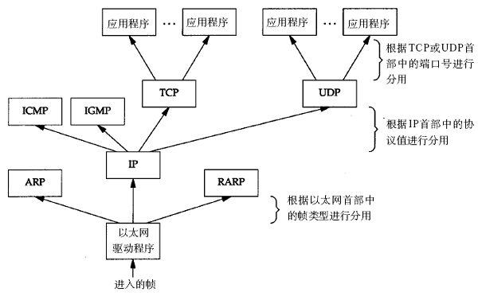

#  gotcpip
用golang 实现tcp/ip协议

src_code 是用来学习的源码

# TCPIP 和开放系统互连（OSI）模型

本节先简单介绍互联网的发展史，然后讲解 TCPIP 和开放系统互连（OSI）模型，最后会介绍一下用户态协议栈的整体框架。

## 计算机互联网发展史
最开始的时候计算机是单独运算的，一般有一个大型主机放在那里，然后可以多个终端连接一个主机进行操作。那时候美国国防部认为，如果仅有一个集中的军事指挥中心，万一这个中心被原苏联摧毁，全国的军事指挥将处于瘫痪状态，其后果将不堪设想，因此有必要设计这样一个分散的指挥系统，它由一个个分散的指挥点组成，当部分指挥点被摧毁后其它点仍能正常工作，而这些分散的点又能通过某种形式的通讯网取得联系，这个研究项目就是著名的 ARPANET（阿帕网），也就是互联网的前身。在 1969 年，ARPANET 真正把计算机第一次互联，使用 BBN 公司开发的接口消息处理器（IMP）建立节点。当时的详细节点信息如下：

``` markdown
节点1：UCLA(8月30日，9月2日接入)
功能：网络测量中心
主机、操作系统：SDS SIGMA 7

节点2：斯坦福研究院(SRI)(10月1日)
功能：网络信息中心(NIC)
主机、操作系统：SDS940
Doug Engelbart有关Augmentation of Human Intellect的计划

节点3：加州大学圣巴巴拉分校(UCSB)(11月1日)
功能：Culler-Fried交互式数学
主机、操作系统：IBM 360/75

节点4：Utah大学(12月)
功能：图形处理
主机、操作系统：DEC PDP-10
由Steve Crocker编写第一份RFC文件Host Software(1969年4月7日)。
REC 4：Network Timetable
UCLA的Charley Kline试图登录到SRI上，发出了第一个数据包，
他的第一次尝试在键入LOGIN的G的时候引起了系统的崩溃。(1969年10月20日或29日，需查实)
```

可以看出，当时硬件和系统都不是统一的，当然通信的接口也是不统一的，他们需要 IMP 连接和处理才能彼此通信。

> ARPANET 的特点

- 可以共享硬件、软件和数据库资源。
- 利用分散控制结构。
- 应用分组交换技术（包交换技术）。
- 运用高功能的通信处理机。
- 采用分层的网络协议。

ARPANET 早期使用一种网络控制协议（Network Control Protocol，NCP）来达到主机与主机之间的通信，但是它无法和个别的计算机网络做交流，因为设备之间没有一个标准协议。1972 年，ARPANET 项目组的核心成员 Vinton Cerf 和 Bob Kahn 开始合作开展所谓的网络互联相互（Interneting Project）。他们希望连接不同的网络，使得一个网络上的主机能够与另一个主机网络上进行通信，需要克服的问题很多：不同的分组大小、不同的接口类型、不同的传输速率、以及不同的可靠性要求。Cerf 和 Kahn 提出利用被称为网关的一种设备作为中间的硬件，进行一个网络到另一个网络的数据传输。

之后 Cerf 和 Kahn 在 1974 年发表了里程碑式的文章 Protocol for Packet Network Interconnection，描述了实现端到端数据投递的协议，这是一个新版的 NCP，叫传输控制协议（TCP）。这篇文章包括了封装、数据报、网关的功能等概念，其中主要思想是把纠错功能从 IMP 移到了主机。同时该协议（TCP）被应用到 ARPANET 网络，但是此时依然没有形成一个网络标准，各种协议并存包括 NCP，TCP 等协议。

在 1977 年后，TCP 被拆分成两个网络协议：传输控制协议（TCP）和因特网协议（IP），IP 处理数据包的路由选择，TCP 负责高层次的功能，如分段、重组、检错。这个新的联合体就是人们熟知的 TCP/IP。

1980 年发表 UDP 协议。

1981 年 UNIX 系统集成了 TCP/IP 协议栈，包含网络软件的流行操作系统对网络的普及起了很大的作用。

1983 年原先的交流协议 NCP 被禁用，TCP/IP 协议变成了 ARPANET 的正式协议，同时 ARPANET 分裂成两个网络：军用网（MILNET）和非军用的 ARPANET。之后，NCP 成为历史，TCP/IP 开始成为通用协议。

1984 年 ISO 发布了开放式系统互联模型（OSI）。

再之后，互联网极速发展，更多的主干网被搭建，更多的主机连接进来，直至组成了世界互联的巨大网络。

## OSI 模型和 TCPIP 模型

> OSI 模型

+------------------------------+
|           应用层              | Application
+------------------------------+
|           表示层              | Presentation
+------------------------------+
|           会话层              | Session
+------------------------------+
|           传输层              | Transport
+------------------------------+
|           网络层              | Network
+------------------------------+
|           链路层              | Link
+------------------------------+
|           物理层              | Physical
+------------------------------+

> TCPIP 模型

+------------------------------+
|           应用层              | Application
+------------------------------+
|           传输层              | Transport
+------------------------------+
|           网络层              | Network
+------------------------------+
|           链路层              | Link
+------------------------------+

虽然现实中实现的协议栈都是 TCP/IP 模型，但是我们也需要了解 OSI 模型，它很有参考意义，我们平常交流讲到网络分层的时候都是用 OSI 模型来讲的，所以开发者一般实现的时候是 TCPIP 模型，但和别人讨论的时候是 OSI 模型。比如我们一般讲的二层网络，三层网络指的是 OSI 模型的链路层和网络层。下面介绍 TCP/IP 模型各层功能。

## TCPIP 各个层的主要功能
### 链路层
链路层也是将数据包发送到另一台主机，但是这两台主机一定是同个局域网的（不考虑广域网二层打通的情况），链路层负责将网络层交下来的 IP 数据报组装成帧，在两个相邻节点间的链路上传送帧。链路层的通信就像在一栋小楼里面互相讲话一下，小明想与小红讲话，只要在楼里喊一下，“小红你在吗？”，小红听到了就会回复说，“小明，我在啊”。小明在喊小红的时候，在这栋楼里的其他人也听得到，这种行为叫广播。链路层网络不适合大型网络，因为一旦主机多了，广播会比较占用资源，就像楼里大家都在喊别人一下，听起来会很乱。

## 网络层
网络层负责将数据报从一台主机发送到一台目标主机上（注意：这两个主机可以不相邻），并给每个主机分配一个地址。最著名的就是 IP 协议了，每个主机都至少有一个 IP 地址，根据路由策略将收到数据报发往下一个主机，这个过程就叫路由转发，它是实现国际网的基础。对于网络层的通信，小明和小红就不是在一栋楼里了，他们可能隔了一个省，此时小明再怎么喊，小红也听不到，怎么办？那就寄信封吧，把信写好，交给邮差，邮差根据地址送给下一个驿站，驿站再根据地址送给下一站，知道送到小红那，这个过程就很像路由，根据目的地址选择下一跳地址。有时候小明有太多话想跟小红讲，导致一封信已经装不下了，那么就会用几张信封来装信件，这个过程就像分片，因上层数据包太大，将数据包切割。当然逆向过程就叫重组。

### 传输层
**传输层最主要的目的就是给两个应用程序传输数据，注意是两个程序，不是两个主机。***主要的协议有 tcp 和 udp，tcp 为应用提供了虚拟连接的服务，也提供了数据的可靠性。udp 提供的是无连接服务，也不提供可靠服务，仅仅实现让两个程序之间交换数据。

### 应用层
应用层是利用传输层的接口来实现用户自定义的网络应用，例如 HTTP 应用，SMTP（邮件传输）应用等。正因为应用层各色各样的应用，才让网络传输有了意义。比如微信，QQ，淘宝网等，这些我们常见的应用都离不开网络的传输。

### 为何要分层
分层当然是有原因的，主要的目的是为了灵活性和方便实现。分层可以允许供应商进行独立开发，各层通过一个接口在相邻层通信。每层只要专注自己的事情，而不是关心其他层，这样方便软件或者硬件的实现，定义好每个层之间的接口，更改一层的内部实现，不会影响其他层，这样更灵活。比如，TCP 协议就不管下一层是 ipv4 还是 ipv6，它们都实现了网络层的接口，能寻址发送和接收数据包。

这种思想到处可见，我们要解决一个复杂的问题时，一般都是拆分层小问题，然后分别解决小问题，分层也是一样，它的本质就是为了分离关注点而让问题简单化或者更高效。


## 封装与解封装
各个层需要加上自己的控制信息，就会为每层定义自己的控制信息，不同的协议层对数据包有不同的称谓，在传输层叫做段（segment），在网络层叫做数据报（datagram），链路层叫做帧（frame），物理层层叫比特，数据封装成帧后发到传输介质上，到达目的主机后每层协议再剥掉相应的首部，最后将应用层数据交给应用程序处理。

每层发送数据时加上自己的控制信息叫封装。


收到数据包剥掉相应的首部叫解封装，解封装的时候会得到上层的协议，去除本层首部信息后，将会把数据包分发给上层协议。



## 你是如何冲浪的呢

一般情况家里的上网流程如下，但不是一定是这样，请读者注意！

首先你得购买互联网服务提供商（ISP，如：中国电信）提供的账号密码；
- 启动家用路由器，假设路由器内网地址为 192.168.1.1，接着配置账号密码，通过拨号和 ISP 建立连接，ISP 会返回一个公网 IP 地址，假如 IP 为 1.1.10.1；
- 然后再把电脑插到家用路由器的网口上，那么电脑就获取到了内网 IP 地址，假如为 192.168.1.2，这时候家用路由器就是电脑的默认网关，和家用路由器的相连的网卡假设为 en0；
- 当在浏览器访问 https://www.baidu.com 时，浏览器会发起 DNS 请求得到对应的 IP，假如为 180.97.33.18，DNS 请求的详细过程我们暂时忽略；
- 拿到 IP 后，浏览器会使用 tcp 连接系统调用和远端主机建立连接，系统调用会进入内核；
- 内核先通过路由最长匹配查询目标 IP 下一跳地址，也就是邻居地址，比如目的 180.97.33.18 会匹配下一跳地址 192.168.1.1;
- 内核接着查询 ARP 表，得知下一跳地址的网卡和物理 MAC 地址，如果没有查询到，则会发送广播 ARP 请求，得到 MAC 地址；
- 到目前为止发送 tcp 报文所需的信息都有了，目标 IP 和目标 MAC 地址，此时系统会给 tcp 的连接分配一个源端口，假如为 33306；
- 之后完成 tcp 三次握手，将 HTTP 请求报文封装在 tcp 数据段中发送给网卡 en0；
- 家用路由器接收到电脑的数据报，经过源地址转换（SNAT），将数据报文发送给 ISP；
- ISP 通过路由表选择发送给下一个路由，经过多个路由转发最终达到百度的服务主机；
- 百度服务器得到电脑发送的报文，返回 HTTP 响应，按原路返回给家用路由器；
- 家用路由器接收到 HTTP 响应报文后，经过目标地址转换（DNAT），将数据发送给电脑；
- 电脑上的浏览器接收到 HTTP 响应，渲染页面，呈现出网页；

## 协议栈整体框架
本课程参考netstack，基于 linux 的 tap 网卡，来实现一个用户态的 tcp/ip 协议栈。

协议栈的整体架构如下：

+----------------------+
|        tcp/udp       | transport
+----------------------+
|    arp/ipv4/ipv6     | network
+----------------------+
|         vnic         | nic_manager
+----------------------+
|         tap          | link
+----------------------+

- 链路层我们用 tap 网卡实现，它是 linux 下的一种虚拟网卡，能提供链路层的功能，发送和接收以太网帧。
- 协议栈还实现了对虚拟网卡的一定管理，就像 linux 对物理网卡的管理一样。
- 网络层实现了 arp、ipv4 和 ipv6 协议，arp 协议虽然被划分在网络层，但是链路层的工作离不开它，所以第二章讲链路层通信的时候会介绍。ipv4 协议中的 icmp 和 ipv6 中的邻居协议也实现了，后面会讲解 ipv4 和 icmp 协议。
- 传输层会实现了 tcp 和 udp，在讲传输层之前会先介绍端口的概念。传输层中的 tcp 实现应该是整个协议栈中最复杂的，会按功能拆分来讲解。

值得注意的是这里说的协议栈是主机上的协议栈，不是交换机，也不是路由器的协议栈。

整体来说，实现一个协议栈并没有想象中的那么复杂，如果排除了 tcp 的各种机制实现，那么协议栈其实很简单，就是封装与解封装的过程，所以协议栈的代码有很大部分也是各层对数据包的封装与解封装。tcp 的实现会根据每个特性来拆分讲解和实现，以便更容易理解和实现。

# 链路层的基本实现 


